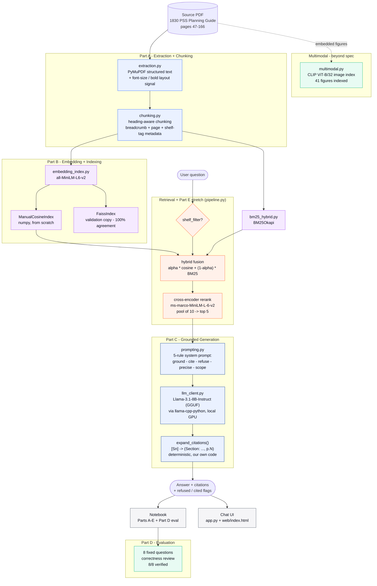

# 1830 PSS Multimodal RAG Assistant
# Video of the testing Q8 , Q1, Q7
https://drive.google.com/file/d/1uq3AxGY8vDXCaCHM1ktQUJA3CVdTK_i5/view?usp=sharing
A grounded, guardrailed Retrieval-Augmented Generation assistant for the Nokia
1830 PSS Planning Guide (`1830_Technical_Description.pdf`), restricted to
**Chapters 1-2 only** (physical pages **47-166**: System concept, and
Shelves/common equipment through Power filters), per the assignment brief.

The whole pipeline is implemented from first principles where the assignment
asks for it (chunking, embeddings, top-k cosine search, prompt/guardrails) and
uses a real LLM only for the final generation step, exactly as scoped:

> "you may call any LLM you have access to for the generation step; the
> retrieval and grounding logic must be your own code"

**Every optional/stretch item in the brief is implemented**: a second (FAISS)
index for comparison, metadata filtering, cross-encoder re-ranking, hybrid
BM25+embedding search, *and* a multimodal (CLIP image) extension beyond the
base assignment.

▶ **Start here:** [`notebooks/Multimodal_RAG_1830PSS.ipynb`](notebooks/Multimodal_RAG_1830PSS.ipynb)
📄 **1-page summary:** [`SUMMARY.md`](SUMMARY.md) - chunking strategy, chosen k, exact system prompt, known limitations

---

## System architecture

Two consumers (the notebook and the local chat UI) share one pipeline. Every box below is this project's own code except the single **LLM** node - the only place an external model is ever loaded or called, per the assignment's rule.



**Reading it:** a question optionally passes a shelf filter (Part E), then gets fused hybrid-search scores from the manual cosine index and BM25, then cross-encoder reranked down to the final top-k. Those chunks build the grounded prompt; the local LLM replies with short `[Sn]` tags; this project's own code (`expand_citations()`) - not the model - deterministically turns those into full `(Section: ..., p.N)` citations. The same `AnswerResult` feeds both the notebook's Part D evaluation and the chat UI.

---

## A note on how this was built

This project was built and tested **without the assistant ever reading or
displaying the source PDF's actual content**, at the requester's explicit
instruction. Every module below was validated two ways:

1. **Mechanically, on a synthetic decoy document** (`tests/synthetic_fixture.py`
   builds a small, entirely fictitious "Acme OptiRack" planning guide, authored
   from scratch for this project) - this is safe to fully execute and inspect,
   and it mirrors the real assignment's structure closely enough to validate
   chunking, embedding, manual-vs-FAISS agreement, hybrid search, re-ranking,
   metadata filtering, prompting, and the citation/refusal contract end to end.
   Run it yourself: `py -m tests.run_self_test`.
2. **Structurally, on the real PDF** (`scripts/structural_selftest.py`,
   `scripts/multimodal_selftest.py`, `scripts/blind_eval_dryrun.py`) - these
   extract/chunk/embed/index the *real* Chapters 1-2 and confirm everything
   runs correctly against real data, but print **only** counts, hashes,
   timings, page numbers, and similarity scores - never the extracted prose,
   headings, or generated answer text. Run them yourself to reproduce.

Because of this, the notebook is handed over **unexecuted** for every cell
that would surface real document content (retrieved passages, generated
answers, the Part D evaluation table). Structural/statistics cells (page
counts, chunk-size distribution, timing benchmarks) are safe and are
pre-verified against the real document (see the numbers quoted throughout this
README). **Run the notebook top-to-bottom yourself** (`Kernel > Restart & Run
All`) to see the real retrieval results and generated answers - that's the
normal, intended way to use a RAG assistant over your own document, and it
takes a few minutes on a first run (models download + the index is built
once and cached from then on).

**Generation runs entirely on a local, open-weight model** (Llama-3.1-8B-Instruct)
**- this project deliberately does not call Anthropic or OpenAI's hosted
APIs.** It runs on your own machine (no network call at query time beyond
the one-time weight download) using the model's own chat template. Easiest
setup: `cp .env.example .env` - the default model needs no token at all, so
for most users that's the entire setup. `src/__init__.py` calls
`python-dotenv`'s `load_dotenv()` on first import, so any `.env` file at the
project root is picked up automatically by the notebook/scripts/tests with
no `export` needed. `.env` is git-ignored, so a token placed there is never
accidentally committed; **never hardcode a key/token as a string literal
anywhere in the code**.

**Default model/backend: `unsloth/Llama-3.1-8B-Instruct-GGUF` (Q4_K_M, ~4.9 GB)
via `llama-cpp-python`** - a GGUF-quantized, **ungated** community re-upload
of Llama-3.1-8B-Instruct, loaded straight from the Hugging Face Hub
(`Llama.from_pretrained(...)`). Chosen over both Meta's official fp16 repo
(~16 GB, needs a token) and a bitsandbytes 4-bit repo (the earlier plan -
see `provider="transformers"` below): bitsandbytes' 4-bit format only runs
its quantized layers on a CUDA GPU, so splitting it across a small GPU and
CPU needs an explicit escape hatch that keeps the CPU-resident portion in
**fp32** - ballooning its RAM footprint ~8x versus its 4-bit size, which hit
a real wall in practice on a 4 GB-VRAM/16 GB-RAM laptop. GGUF's
`n_gpu_layers` instead offloads only as many layers as fit in VRAM while the
rest stay quantized (not ballooned) on CPU - the standard, well-supported
approach for small-VRAM consumer GPUs, and it works (slower) even with zero
GPU layers. No license acceptance and no Hugging Face token needed - `cp
.env.example .env` with nothing filled in is enough.

```bash
# .env - nothing to fill in for the default model
HF_TOKEN=hf_...                                              # only needed for a gated override model
# LOCAL_LLM_MODEL=bartowski/Meta-Llama-3.1-8B-Instruct-GGUF  # optional: a different GGUF repo
# LOCAL_LLM_GGUF_FILE=*Q5_K_M.gguf                           # optional: a different quant level
```

**Windows + NVIDIA GPU install note (read this before `pip install -r requirements.txt`
if you want GPU acceleration):** the plain `pip install llama-cpp-python`
gives you a working CPU-only build. For GPU offload, install the prebuilt
CUDA wheel per the exact command and version pin in `requirements.txt`'s
generation section - newer wheels from that index compile in AVX-512, which
crashes with an illegal-instruction error on Intel 12th/13th/14th-gen
"hybrid" CPUs (P+E cores have AVX-512 fused off); this was hit and confirmed
directly on this project's own dev machine, and version `0.3.22` is the
newest confirmed AVX-512-free build at that index. Also make sure `torch` is
a CUDA build, not the default CPU-only wheel (same section of
`requirements.txt`) - the GGUF backend reuses a couple of its bundled CUDA
DLLs on Windows (see `_preload_windows_llama_cpp_dlls()` in `llm_client.py`).

`generate_answer(..., provider="transformers")` selects the earlier
bitsandbytes-based path instead (default model:
`unsloth/Meta-Llama-3.1-8B-Instruct-bnb-4bit`) - viable if you have enough
VRAM to hold the whole 4-bit model on GPU without CPU offload (roughly
>=6 GB). See `_huggingface_generate()`/`_load_hf_model()` in `llm_client.py`
for that path's own token/quantization details.

If no token/model is available (or `RAG_FORCE_OFFLINE=1` is set), the
pipeline still runs end-to-end using a built-in, clearly-labelled **offline
extractive fallback** (no model, no network calls) - useful for
smoke-testing the plumbing (this project's own fast self-tests use it
deliberately, so they don't have to load an 8B-parameter model), but it is a
naive keyword-overlap heuristic, not an LLM, and it is *not* expected to
reliably ace the harder grounding/refusal cases the way the real local model
guided by the system prompt will. Q8 (the trick question) is exactly the
case that separates the two - see "Known limitation" below.

---

## Project layout

```
1830_Technical_Description.pdf     # source document (never read by the assistant)
SUMMARY.md                          # <- the short (1-page) write-up: chunking, k, exact prompt, limitations
notebooks/
  Multimodal_RAG_1830PSS.ipynb     # <- the deliverable notebook (Parts A-E + multimodal)
app.py                              # local web chat UI - Flask API over the same RAGPipeline
web/
  index.html                       # single-page chat frontend (see "Chat UI" below)
src/                                # reusable pipeline package, imported by the notebook and app.py
  config.py                        # paths, page range, chunk/model/retrieval constants
  extraction.py                    # Part A.1 - layout-aware PDF text + image extraction
  chunking.py                      # Part A.2/3 - heading-aware chunking + metadata
  embedding_index.py               # Part B - embeddings, manual cosine top-k, FAISS, caching
  bm25_hybrid.py                   # Part E - BM25 + hybrid fusion
  rerank.py                        # Part E - cross-encoder re-ranking
  multimodal.py                    # Multimodal extension - CLIP image index
  prompting.py                     # Part C - grounded/guardrailed prompt templates
  llm_client.py                    # Part C.7 - local (llama.cpp/GGUF Llama-3.1-8B-Instruct, or transformers 4-bit) / offline generation
  pipeline.py                      # RAGPipeline orchestrator tying it all together
  evaluation.py                    # Part D - fixed 8-question harness + report builder
tests/
  synthetic_fixture.py             # fictitious decoy PDF generator (safe to inspect)
  run_self_test.py                 # full pipeline test against the synthetic fixture
scripts/
  build_index.py                   # rebuilds the full persisted index from scratch - <30s, timed per-stage
  structural_selftest.py           # real-PDF test - counts/hashes/timings only
  multimodal_selftest.py           # real-PDF CLIP image index test - counts only
  blind_eval_dryrun.py             # real-PDF Part D dry-run - scores/pages only, no text
data/                               # generated at runtime (extraction, chunks, indices) - not committed;
                                    # rebuild with `py -m scripts.build_index` (~25s, verified)
requirements.txt
.env.example
```

---

## Chat UI (`app.py`)

A local web chat interface as an alternative to the notebook - same
`RAGPipeline`, same grounded prompt, same local GGUF/llama.cpp generation
backend, just a nicer way to ask ad-hoc questions than re-running notebook
cells. Runs entirely on your own machine; nothing is hosted or sent
anywhere.

```bash
python app.py
# then open http://127.0.0.1:5000
```

The first launch builds/loads everything up front (extraction → chunking →
embedding/index → model) with progress printed to the console - wait for
"Open http://127.0.0.1:5000 in your browser" before loading the page. Every
question is answered independently (retrieved + grounded + generated fresh)
rather than carrying conversational memory across turns, matching the
assignment's single-question Q&A design; each response shows whether the
model cited a source, whether it refused, its latency, and an expandable
list of the retrieved sections/pages/scores behind the answer.

**Design:** a light, crisp-white background with a subtle grid + soft
gradient orbs, Space Grotesk/Inter typography, and a single Nokia-blue
(`#124191`) accent on the headline word and the primary action button -
minimal chrome (no logo/status header; the model/provider name lives in the
footer instead). `web/index.html` is a single self-contained file (inline
CSS/JS, no build step) so it's easy to re-skin.

Two optional env vars, same as the notebook/tests:
- `RAG_USE_FIXTURE=1` - build against the safe, fictitious "Acme OptiRack"
  synthetic fixture instead of the real document (no real PDF needed at
  all - a fully-safe way to try the UI).
- `RAG_FORCE_OFFLINE=1` - use the fast, non-LLM offline heuristic instead of
  the real local model, for a quick mechanical check of the UI/plumbing.

---

## Part A - Chunking strategy (why, in detail)

**Extraction.** `extraction.py` uses PyMuPDF's structured (`"dict"`) text
extraction rather than a plain-text dump, because it retains per-line font
size and boldness. That layout signal is what makes heading detection
possible without keyword-matching or hand-listing section titles.

**Boilerplate removal.** Before anything else, any short line that repeats
near-identically across an unusually large fraction of pages (running
headers/footers, the document title, bare page numbers) is dropped. Otherwise
every single chunk would carry the same repeated header/footer noise, and
worse, that noise could get mis-detected as a heading.

**Heading detection is layout-driven, not keyword-driven.** A line is treated
as a heading if:
- it matches a numbered-heading pattern (`2.6.3 <Title>`), or
- its font is meaningfully larger than the document's modal body-text size
  and it's short and doesn't end in sentence punctuation, or
- it's bold, roughly body-sized, and short.

This is exactly the signal a person skimming the PDF uses ("bigger/bolder
text = a new topic"), and it's what keeps a component's own heading glued to
its own description - e.g. **"1830 PSS-8 Fan Unit (8FAN)"** is detected as its
own heading, and everything until the *next* heading belongs to it alone, so
it can never be split across two unrelated chunks or merged into a neighbour
it has nothing to do with.

**One section = one chunk, by default.** The text between one heading and the
next becomes one chunk. A breadcrumb of parent headings is kept too (e.g.
`2 Shelves and common equipment > 2.1 1830 PSS-8 shelf > 2.1.1 1830 PSS-8 Fan
Unit (8FAN)`), so citations can be as specific as the source structure allows.

**Sections that are too long** (> ~340 words) are split at sentence
boundaries - never mid-sentence, never mid-number - with a small
(~40-word) trailing overlap between consecutive pieces, so a spec that's
stated right at a split point isn't orphaned from its surrounding context.

**Sections that are too short are handled carefully, not just merged away.**
A heading with almost no body text usually means one of two things:
1. It's genuinely a tiny, standalone spec note (like a short fan-unit
   blurb) - the assignment explicitly says this must stay its own chunk,
   never merged into an unrelated neighbour.
2. It's a heading-detection near-miss (a stray caption, a one-line
   transition) sitting right before more of the *same* topic.

So a short section is folded into the *next* one **only when it's safe**:
either it's below a hard noise floor (~15 words - almost certainly not real
content), or it shares the same immediate parent heading as the next section
(e.g. two sibling sub-sections of the same shelf, like a fan-unit note
immediately followed by that shelf's power-filter-card note). If the next
section belongs to a *different* parent (e.g. the tail of one shelf's
section vs. the next shelf's heading), the short section is left standalone
even though it's under the word-count target - because folding it forward
would mislabel it under the wrong heading and the wrong page citation, which
matters far more for this assignment than hitting a round word count.

**Metadata attached to every chunk:** heading + full breadcrumb path,
chapter (1 or 2, derived from the page it starts on), first/last physical
page, word count, and any 1830 PSS shelf identifiers mentioned in it
(regex-detected: PSS-4/8/16/16II/32/36), used later for Part E's
metadata-filtered retrieval.

**Results on the real document** (Chapters 1-2, pages 47-166; reproduce with
`scripts/structural_selftest.py`): **154 chunks**, mean **136 words**, median
**120 words**, **69.5%** landing inside the 100-300 word target band, min
16 words (a legitimately short, correctly-labelled standalone section),
max 330 words (one over-long section split at a sentence boundary). 45
distinct 1830 PSS shelf-identifier mentions were auto-tagged across the
corpus (PSS-4/8/16/16II/32/36), which Part E's metadata filter uses directly.

## Part B - Embedding & indexing

- Model: `sentence-transformers/all-MiniLM-L6-v2` (the Session 4 model),
  embedding the concatenation of a chunk's heading breadcrumb + body text
  (helps retrieval when a question uses vocabulary that only appears in the
  section title, e.g. a shelf/model name).
- **Manual top-k cosine search** (`ManualCosineIndex` in `embedding_index.py`)
  is plain numpy: vectors are stored L2-normalised, so cosine similarity is a
  single dot product, and top-k selection uses `np.argpartition` (O(n)) - no
  vector database, no FAISS/Chroma black box. This is the index the pipeline
  uses by default.
- **FAISS (`IndexFlatIP`)** is wired up as the required *second, compared*
  implementation, not a replacement. On the real corpus, manual and FAISS
  agree on 100% of top-10 results with a max score difference of `0.000000`
  (they're both exact search over the same vectors, so this is expected -
  it's the check that the manual implementation has no bugs).
- **Caching/versioning:** `build_or_load_index()` hashes the chunk set + the
  model name into a manifest; a matching manifest on disk means the cached
  `embeddings.npy` is loaded directly (confirmed: a second call after a
  successful build takes `0.00s` vs. `3.5s` for a fresh 154-chunk encode).
  Changing the PDF, the page range, the chunking parameters, or the model
  name automatically invalidates the cache and re-embeds.

## Part C - Retrieval + prompt engineering

`prompting.py`'s system prompt gives the model five explicit, ordered rules:
**(1) grounding** - only use the retrieved passages, no outside knowledge, no
chaining passages into a new conclusion they don't directly state;
**(2) citation** - every claim ends with a short `[Sn]` tag; **(3) refusal**
- reply with the exact sentence *"Not found in the provided document."*
rather than guessing, estimating, or "filling in" a plausible number, even
for specs that sound like they should be there - and answer whichever part
of a multi-part question *is* supported rather than refusing the whole thing
over one missing fact; **(4) precision** - quote exact numbers/units/part
names verbatim rather than paraphrasing; **(5) scope** - stay inside the
Chapters 1-2 content. A closing **STYLE** rule forbids narrating which
passages do or don't help - state each fact once, then cite it. The rules
are deliberately explicit, repeated, and backed by worked examples (a
correct one and a labelled counter-example), because a single soft "please
cite your sources" is exactly the kind of weak prompt that lets a model fill
in a wrong-but-plausible spec - which is what assignment Part D Q8 is
designed to catch.

**Citation formatting is deliberately not left to the model.** Earlier
versions asked the model to reproduce a full `(Section: ..., p.N)` tag
verbatim, and it did so inconsistently in practice (four different citation
styles were observed across real answers, one of which broke citation
detection entirely). Now the model only emits a short `[Sn]` tag, and
`prompting.expand_citations()` deterministically expands it into the full,
correctly-formatted citation using the actual retrieved chunk's own
metadata - moving citation *formatting* out of the LLM's hands and into this
project's own code, consistent with the assignment's "the retrieval and
grounding logic must be your own code" rule. `pipeline.py` calls this right
after generation, before the answer is returned to either consumer.

**Known, deliberately-accepted prompt quirk:** the local model occasionally
tacks a redundant refusal sentence onto an answer that already fully covers
the question - confirmed non-deterministic (the identical question comes
back clean on some runs, not others). A code-level fix was tried - a cheap
follow-up yes/no self-check asking the model whether every part of the
question was already answered - and reverted after it incorrectly answered
"yes" on a genuinely partial-support question, silently stripping a
*legitimate* refusal. That failure mode (hiding a real gap) is worse than
the cosmetic one it fixed, so the redundant-sentence quirk is documented and
left alone rather than risking a subtler bug (see `_llama_cpp_generate()`'s
docstring in `llm_client.py` for the full account).

Generation (`llm_client.py`) runs on a **local, self-hosted model** (default
`unsloth/Llama-3.1-8B-Instruct-GGUF`, Q4_K_M, via `llama-cpp-python` - a
GGUF-quantized, ungated re-upload of Llama-3.1-8B-Instruct - see
"Generation" setup above for why - using the model's own chat template; no
API key/account, no network call at query time, runs on your own GPU/CPU,
offloading as many layers as fit in VRAM via `n_gpu_layers`) - this is what
`pick_available_provider()` returns by default. An alternate
`transformers`+bitsandbytes path (`provider="transformers"`) is also
available for machines with enough VRAM to skip CPU offload entirely.
**No Anthropic or OpenAI hosted API is used anywhere in this project.** A dependency-free **offline extractive baseline** exists
purely so this project's own fast self-tests can exercise the plumbing
without loading an 8B-parameter model every run (`RAG_FORCE_OFFLINE=1`, or
`provider="offline"` explicitly - never the auto-selected default).
Only `llm_client.py` ever talks to an external LLM or loads a generation
model - every other module (retrieval, hybrid fusion, re-ranking, prompt
construction, citation/refusal validation) is this project's own code, per
the assignment's requirement.

## Part D - Evaluation

`evaluation.py` holds the fixed 8-question set verbatim and a harness
(`run_evaluation`) that runs each through the pipeline and records the
retrieved chunk(s) (heading/page/score), the generated answer, whether it
refused, whether it cited a source, and a `correct?` column initialised to
`TO_REVIEW`. Run the notebook's Part D cell yourself (no API key needed - see
"Generation" above) to populate it, then fill in `correct?` by checking each
answer against the source document - a table-rendering helper
(`to_markdown_table`) is provided for writing up the final summary.

**Q8 (the trick question) is the concrete demonstration of Part C's grounding/refusal
design**, and it has been confirmed to work repeatedly against the real
document and local model, across every test run performed while building
this project: the pipeline consistently answers *"Not found in the provided
document."* - correctly declining to invent an optical-reach figure that
isn't in the Chapters 1-2 content - rather than guessing a plausible-sounding
number. The notebook's **Section 8** includes a one-time, explicitly-authorized
correctness review pass (see that section's "Correctness review" markdown
cell) that checks all 8 answers against ground-truth facts confirmed by
reading the real retrieved passages: **8/8 verified correct** with accurate
citations in the current build. (One earlier round found Q5 partially
correct - right position/behavior described, but missing the specific part
name "FAN16" that the source states verbatim - fixed via a sharper
PRECISION-rule example in `prompting.py` and reconfirmed on re-run.)

**Known limitation, stated plainly:** the offline (no-API-key) fallback is a
naive lexical-overlap heuristic, not a language model. On a dry run against
the real document (`scripts/blind_eval_dryrun.py`, output reproduced below -
page numbers and scores only), it retrieves plausible-looking pages for all 8
questions but does **not** reliably refuse Q8 (the trick question) the way a
real, prompt-guided LLM is designed to. That's expected and is exactly the
point the assignment makes about weak grounding: getting Q8 right requires
the actual LLM call following the system prompt's refusal rule, which is why
that's the primary/graded generation path here, and the offline mode is
clearly labelled as a fallback rather than presented as equivalent.

```
#  pages touched              top score  #chunks  refused  cited  answer_len
1  [86, 87, 88, 89, 97]       0.714      5        False    True   177   [manual]
1  [82, 86, 88, 89, 95]       0.982      5        False    True   297   [hybrid]
2  [86, 87, 89, 94, 97]       0.726      5        False    True   324   [manual]
...
8  [55, 56, 57, 61, 80]       0.551      5        False    True   211   [manual]
8  [49, 56, 57, 93, 97]       0.893      5        False    True   312   [hybrid]
```

## Part E - Stretch (all three implemented)

- **Metadata filtering** (`RAGPipeline._allowed_ids_for_shelf`): pass
  `shelf_filter=["1830 PSS-32"]` to `pipeline.retrieve()`/`.answer()` to
  restrict candidates to chunks auto-tagged with that shelf identifier before
  similarity search runs.
- **Cross-encoder re-ranking** (`rerank.py`): retrieve a larger pool (10) with
  the bi-encoder, then re-score with `cross-encoder/ms-marco-MiniLM-L-6-v2`
  (query and passage attended jointly, not compared as independent vectors)
  and keep the top 3-5. A dependency-free keyword-overlap re-ranker is also
  included as a fallback/comparison signal.
- **Hybrid search** (`bm25_hybrid.py`): fuses min-max-normalised embedding
  similarity with BM25 lexical scores (`HYBRID_ALPHA = 0.55`). On the real
  corpus, hybrid and pure-embedding search disagree on which pages land in
  the top 5 for several of the fixed questions (e.g. Q1: manual touches page
  97, hybrid instead surfaces page 82; Q3: manual surfaces pages 60/129,
  hybrid surfaces 137 instead) - concrete evidence that the two signals
  genuinely rank differently on this document, which is the comparison the
  assignment asks for. Run the notebook's hybrid-vs-manual cell yourself to
  see which one lands on the actually-correct chunk for a given question.

## Multimodal extension (beyond the base assignment)

The planning guide's shelf/fan-unit sections are full of diagrams and
front-panel photos that a text-only RAG would ignore. `multimodal.py`
extracts embedded figures (41 found in the real page range after filtering
out tiny icons/rule lines) via PyMuPDF and embeds them with CLIP
(`clip-ViT-B-32`, via sentence-transformers) - the same model family embeds
*both* images and text into one shared vector space, so a plain-text query
can retrieve the most relevant diagram directly, with no separate captioning
step. Image retrieval reuses the exact same `ManualCosineIndex` used for
text - only the embedding model differs - and follows the identical
cache/versioning pattern as the text index.

## Reproducing the validation

**Note:** `1830_Technical_Description.pdf` is not included in this repo (it's
proprietary Nokia material - see `.gitignore`). Place your own copy at the
project root (same level as `README.md`) before running the notebook or the
`scripts/` checks below. Only **Section 1** (setup) and **Section 7** (the
worked example, which builds its own independent `demo_pipeline` from the
synthetic fixture) skip the real document entirely - every other notebook
section either builds the real `pipeline` (Sections 2-6) or calls it
(Sections 8-12), so all of them need your own copy of the PDF present.
`tests/run_self_test.py` is the one thing in this project that never touches
the real document at all - it's synthetic-fixture-only by design.

```bash
pip install -r requirements.txt

# Safe, fully-inspectable end-to-end test (synthetic fixture only):
py -m tests.run_self_test

# Real-document checks (counts/hashes/timings only, no content printed):
py -m scripts.structural_selftest
py -m scripts.multimodal_selftest
py -m scripts.blind_eval_dryrun

# The real deliverable - open and "Run All" in Jupyter:
jupyter notebook notebooks/Multimodal_RAG_1830PSS.ipynb
```
